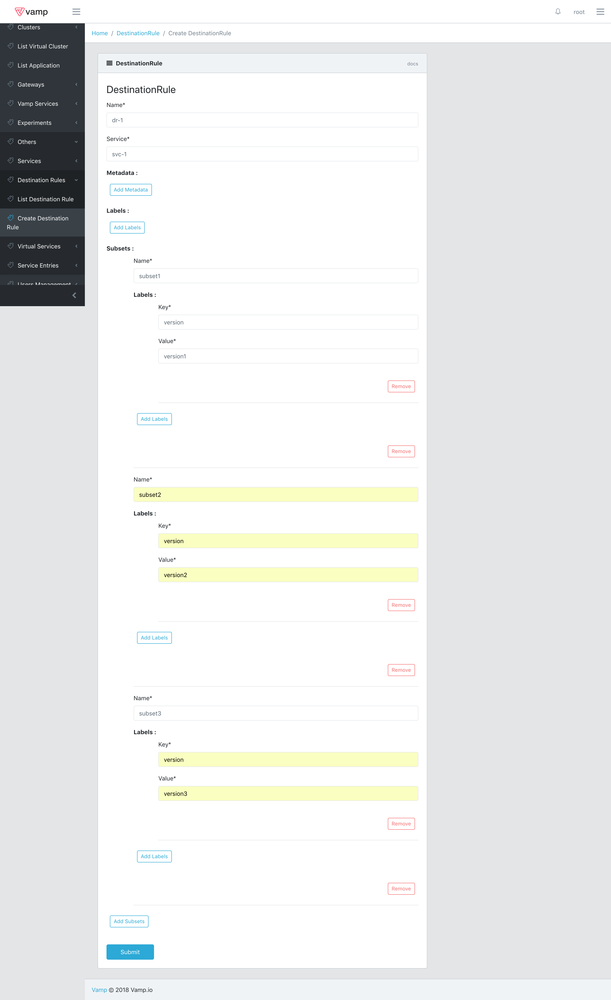
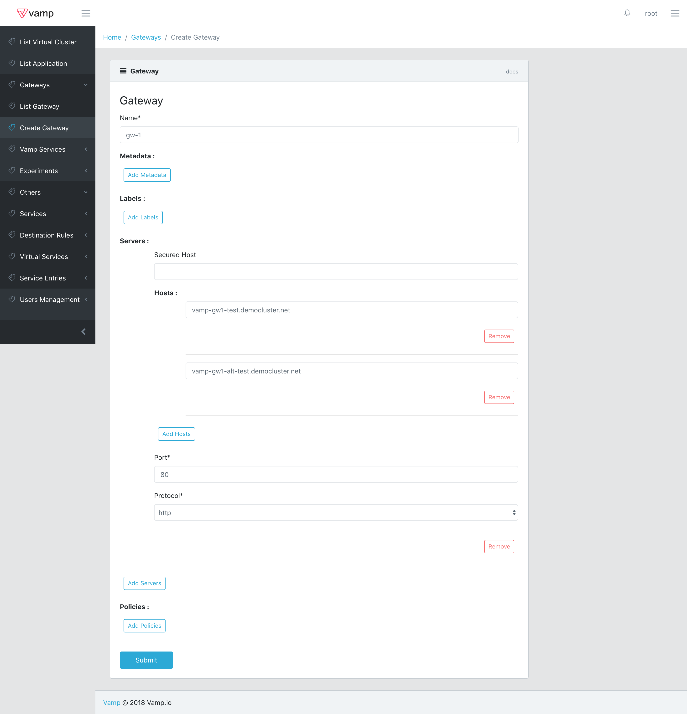
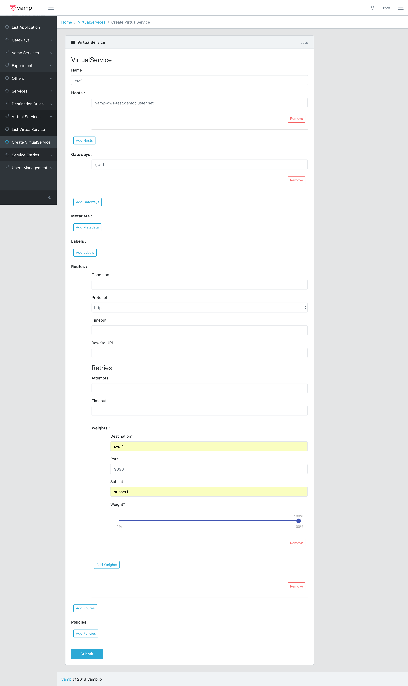
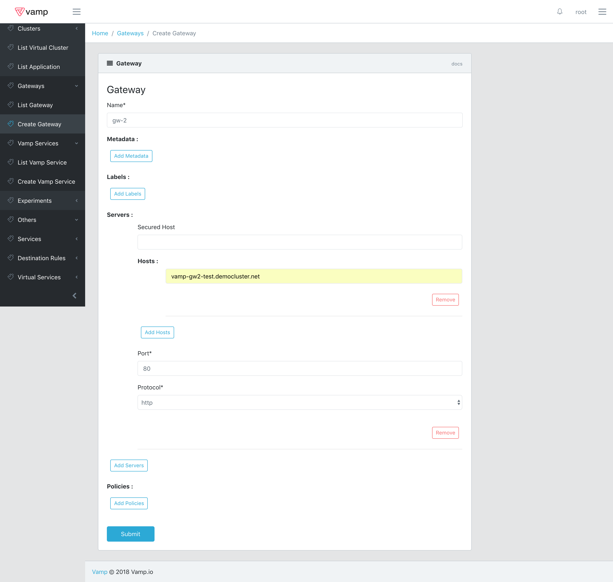
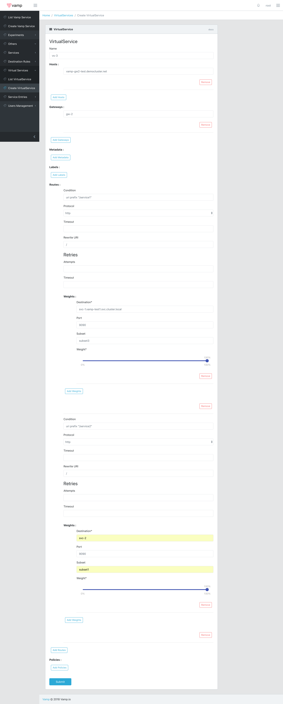
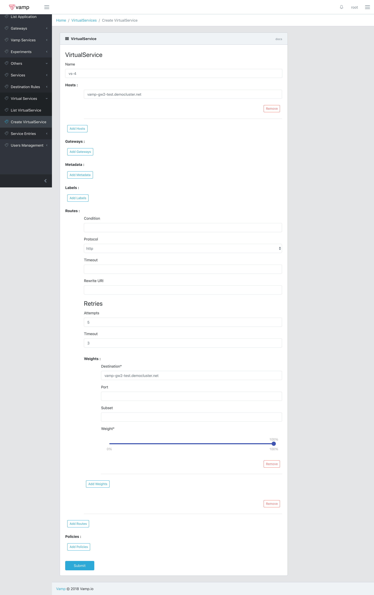

## Advanced Tutorial

To better showcase what Vamp Lamia and Istio can do, let's try and setup an entire environment with multiple virtual clusters and deployments.
The final goal of this example is shown in the image below.


As you can see, at the end of this tutorial you will have three Virtual Clusters, each one with its own deployments and a different networking infrastructure.
**Before continuing make sure to move to a new cluster or cleanup resources created in the previous steps of the tutorial, in order to avoid conflicts, especially on the Gateway level.**
The first step is to set up the Virtual Clusters and Deployments and you can quickly do that by applying the [full-example-setup.yaml](samples/full-example-setup.yaml) with the command:

````
kubectl create -f full-example-setup.yaml
````

By logging into vamp you will now be presented with the following situation.


As you can see the Virtual Clusters have all been imported and by selecting them you will be able to see the Applications and the Deployments they contain.
Let's now focus on Virtual Cluster vamp-test1.
First of all let's create a new Service and Destination Rule for Application app1.




Now you can set up a Gateway to expose the Service you just created to the outside. For this example to work properly you need to define hostnames for the gateways you are going to create.
So, choose two hostnames and specify them in the Gateway configuration as shown below.



Note that what you just did is not enough to map the specified names to the Gateway's ip. You will have to take care of that manually by using either Google DNS or any other online service like, for example, name.com or DNSDynamic.
Now that the Gateway is setup you need only to create a Virtual Service in order to finally access the Service.
To do that, use the following configuration. 
**Take care to specify one of the hostnames you defined in the Gateway and not the one used in the example.**



Shortly after submitting you will be able to access the Service using the hostname you used in the Virtual Service specification.
Let's map also the other hostname, using a second Virtual Service.


Now, if you try calling the second hostname you will be sent to subset2 in the Service you created.
At this point in the tutorial you succesfully mapped two hostnames to two separate subsets of a Service and are able to send requests to them from outside the Cluster.

Having done that, let's try something else.
Go back to List Virtual Cluster and select vamp-test2, as you can see we have an Application app2 running in this Virtual Cluster.
This time you are going to create a single Virtual Service that will respond to a single hostname to the outside world and that will dispatch requests to either Service svc-1 or a new Service.
Dispatching of the requests will be regulated by the url invoked and the url itself will be rewritten before making the actual call to the Service itself.
Let's start with the easy stuff, that is creating the Service, Destination Rule and Gateway.




As you can see the setup is basically identical to what we did in Virtual Cluster vamp-test1. The only significant difference is that we need to use a new hostname for the Gateway definition.
Let's now get to the Virtual Service.
The Virtual Service should dispatch requests starting with '/service1' to svc-1 and requests starting with '/service2' to svc-2. At the same time those url should be rewritten to a simple '/'. 
If we were to skip this last step, the request would fail.
In order to achieve all that, you need to define two conditional routes with the following conditions:

````
uri prefix "/service1"
````

````
uri prefix "/service2"
````

and also specify the value '/' in the rewrite field.
Worthy of note is the fact that, since svc-1 resides in a different Virtual Cluster, we have to use its fully qualified name to be able to reach it, that is svc-1.vamp-test1.svc.cluster.local.
For reference you can find the full configuration below.



If you try now to send requests to the specified hostname with the appropriate url you will be redirected to the correct Service.
Our work with vamp-test2 is finished, let's now focus on the last Virtual Cluster: vamp-test3.
In this Virtual Cluster, as shown in the initial graph, we want to allow access to Virtual Service vs-3 through Gateway gw-2 from outside the Cluster.
**Note that this last example can be set up even on an entirely different cluster from which the original Cluster can be reached. We are limiting ourselves to use a Virtual Clutser for simplicty's sake.
There Are however some real life scenarios in which you might actually want to do that, for example to take advantage of caching.**
External services are normally not reachable from pods belonging to the Istio Mesh, hence we have to somehow make the host defined on Gateway gw-2 accessible. Service Entries are an Istio resource that can do just that.
We are thus going to create one of them with this configuration.


 
By using kubectl to log into one of the pods running into the vamp-test3 namespace you will now be able to send requests to Gateway gw-2 going outside the cluster, like this:


````
curl vamp-gw2-test.democluster.net
````

where vamp-gw2-test.democluster.net should be replaced by the hostname you defined previously.
Thanks to the Service Entry you can now also add a Virtual Service definition that references the external service and use it to define timeouts or retry policies as shown in the following image.



This concludes the tutorial, but feel free to keep on experimenting on the environment you just created; it makes for a good basis to try different setups and explore the available configuration options.
