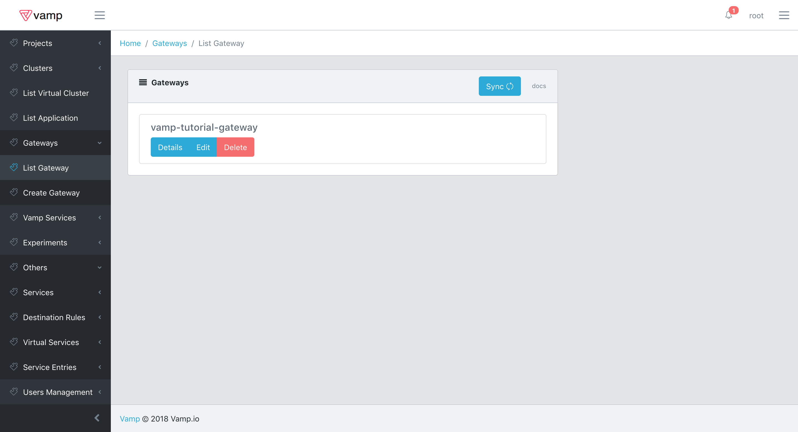

# vamp2setup
Vamp2 Setup Guide

This Guide will help you set up Vamp2 on a kubernetes cluster.

# Prerequisites 
* An existing kubernetes cluster with Kubernetes version 1.9 or above installed.
* Kubectl is should be installed on the local computer with authorised to use the cluster.

# installation steps

git clone this repo or download [link]

```console
$ git clone https://github.com/magneticio/vamp2setup.git
```
or
```console
$ wget https://github.com/magneticio/vamp2setup/releases/download/pre0.0.1/setup.zip
$ unzip setup.zip
```

Run:
```console
$ ./vamp-bootstrap.sh
```

Enter password when asked, password will not be visable and it will be asked twice.

In a happy world, installer will tell you where to connect like:

```console
use http://111.122.133.144:8888 to connect
```

If you need to retrieve the IP afterawrds you can do it via kubectl

```console
kubectl get svc vamp -n=vamp-system
```

Copy the url and paste on your browser and add /ui/#/login

http://111.122.133.144:8888/ui/#/login 

to login and start using.

The default username is root.


## Istio Setup

Once installed, Vamp will automatically check for Istio on the default cluster.
Vamp expects to find the following resources inside the istio-system namesapce:

**Deployments:**

istio-ca              
istio-ingress         
istio-mixer           
istio-pilot           
istio-sidecar-injector
prometheus            

**Services:**

istio-ingress
istio-mixer
istio-pilot
istio-sidecar-injector
prometheus
prometheus-external

**Service Accounts:**

default
istio-ca-service-account
istio-ingress-service-account
istio-mixer-service-account
istio-pilot-service-account
istio-sidecar-injector-service-account
prometheus


Should some of these be missing, Vamp will try to install Istio.
Just keep in mind that if you happen to have pre-existing deployments, after the installation has been completed you will have to restart them or trigger a rolling update in order for the Istio Sidecar to be injected.

## Performing a canary release

### Requirements

In order to perform a canary release you must make sure that you have an Application with at least two Deployments installed in the cluster.
First of all, however you need to set up a Virtual Cluster, or add the correct labels to an existing one.
In this example we will guide you through the creation of a new Virtual Cluster, but you should be able to use these steps as a basis to easily update your pre-existing namespace.
Vamp looks for some specific labels when detecting namespaces to be imported as Virtual Clusters.
These labels are:

- vamp-managed: a label that tells vamp to import and manage resources from this namespace into a Virtual Cluster with the same name.
- istio-injection: a label that allows istio to perform automatic sidecar injection on the deployments in this namespace. 
- cluster: the name of the cluster to which the Virtual Cluster belongs. This label will be addedd if it is missing.
- project: the name of the cluster to which the Virtual Cluster belongs. This label will be addedd if it is missing.

Provided the first two labels are set, upon being deployed, Vamp will import all resources into the current Project and Cluster and add the two missing labels to the namespace.
For this example you can just use the following yaml (also available in the samples folder)

````
apiVersion: v1
kind: Namespace
metadata:
  labels:
    project: default
    cluster: default
    istio-injection: enabled
    vamp-managed: "true"
  name: vamp-tutorial
````

Just copy it into a file and run 

````
kubectl create -f namespace.yaml
````

The new Virtual Cluster will be shown in the corresponding panel on the UI.


From here you can edit the metadata of this Virtual Cluster. 
For example you can associate a Slack webhook to it by adding a key **slack_webhook** with the correct value and a key **slack_channel** with the name of an existing channel.
This will allow vamp to send notifications to that Slack channel.


Once the Virtual Cluster is set up, you should make sure that the Deployments for your Application are created and running.
All deployments require a set of three labels:

- app: identifying the application to which the deployment belongs.
- deployment: identifying the deployment itself. It is mainly used as a selector for the pods.
- version: the version of the application to which the deployment belongs. This is used by Istio to dispatch traffic.

For this example you will simply create two new deployments with the same app label and different deployment and version lables.
To do that simply copy the yaml below it into a file, or get it from the sample folder.
Then you can simply execute:

````
kubectl create -f deployment.yaml
````

````
apiVersion: extensions/v1beta1
kind: Deployment
metadata:
  labels:
    app: vamp-tutorial-app
    version: version1
  name: vamp-tutorial-deployment1
  namespace: vamp-tutorial
spec:
  replicas: 1
  selector:
    matchLabels:
      app: vamp-tutorial-app
      deployment: vamp-tutorial-deployment1
      version: version1
  template:
    metadata:
      labels:
        app: vamp-tutorial-app
        deployment: vamp-tutorial-deployment1
        version: version1
    spec:
      containers:
      - env:
        - name: SERVICE_NAME
          value: version1
        image: magneticio/nodewebservice:2.0.11
        livenessProbe:
          failureThreshold: 5
          httpGet:
            path: /health
            port: 9090
            scheme: HTTP
          periodSeconds: 10
          successThreshold: 1
          timeoutSeconds: 20
        name: deployment1-0
        ports:
        - containerPort: 9090
          protocol: TCP
        readinessProbe:
          failureThreshold: 3
          httpGet:
            path: /ready
            port: 9090
            scheme: HTTP
          periodSeconds: 10
          successThreshold: 1
          timeoutSeconds: 20
---
apiVersion: extensions/v1beta1
kind: Deployment
metadata:
  labels:
    app: vamp-tutorial-app
    version: version1
  name: vamp-tutorial-deployment2
  namespace: vamp-tutorial
spec:
  replicas: 1
  selector:
    matchLabels:
      app: vamp-tutorial-app
      deployment: vamp-tutorial-deployment2
      version: version2
  template:
    metadata:
      labels:
        app: vamp-tutorial-app
        deployment: vamp-tutorial-deployment2
        version: version2
    spec:
      containers:
      - env:
        - name: SERVICE_NAME
          value: version2
        image: magneticio/nodewebservice:2.0.11
        livenessProbe:
          failureThreshold: 5
          httpGet:
            path: /health
            port: 9090
            scheme: HTTP
          periodSeconds: 10
          successThreshold: 1
          timeoutSeconds: 20
        name: deployment1-0
        ports:
        - containerPort: 9090
          protocol: TCP
        readinessProbe:
          failureThreshold: 3
          httpGet:
            path: /ready
            port: 9090
            scheme: HTTP
          periodSeconds: 10
          successThreshold: 1
          timeoutSeconds: 20
````

Assuming you set up everything correctly the deployments will be imported into Vamp and you will be able to check their statuses.
From the UI you can simply select Application - List Application from the bar on the left and you will be presented with the list of available applications.


By selecting the only available application that we just created you will get the list of deployments included in it.


You can esaily double the information presented through kubectl by executing

````
kubectl get deploy -n=vamp-tutorial
````


### Exposing your application

Now that you have your Application running and two Deployments for it you can create a Service and an Ingress to expose them.
Again you can simply use the UI to achieve both tasks.
Simply select Service - Create Service from the bar on the left and fill the form that is shown with the data presented below.


Then submit.
This will create a new service name vamp-tutorial-service that will be accessible internally to the cluster.
You can check the status of this service through the ui by selecting Service - List Service


From here you can edit and delete the service or simply check its details, which is what we are going to do now.


As you can see the service has been created with the configuration provided.
You can doublecheck it with kubectl by running the following command

````
kubectl get svc vamp-tutorial-service -n-vamp-tutorial
````

It's now time to expose the Service externally by creating an Ingress.
As you can probably imagine by now, you can achieve that by selecting Ingress - Create Ingress from the bar on the left and filling the form with the values shown below.



Then hit submit.
By accessing Ingress - Ingress List you will be able to check the new Ingress and also retrieve its IP.


The same can be achieved through kubectl by running

````
kubectl get ing vamp-tutorial-ingress -n-vamp-tutorial
````

When you have found the ip you can just call

````
http://1.2.3.4:9090
````

by replacing the example ip with your own you will get a response from the service. 
Since you just created a standard Service on top of your application, for the time being all request will be distributed equally among the two Deployments that are part of the application.
To change that behaviour it is necessary to create a gateway.

### Creating a Gateway

In order to regulate access to the different versions of your application you now need to create a Gateway for it.
So, select Gateway - Create Gateway and fill out the form with the data presented below, then hit submit.


You can check the status of the Gateway by clicking on Gateway - Gateway List.
This will display the list of Gateways and by selecting the one you just created you will be able to see its current configuration, as shown below.


The current configuration will tell istio to distribute traffic equally among the two versions, so, for the time being you will not be able to see any difference.
You can however change the weight int he body and send a PUT request with the same url in order to experimnet with different settings.
Checking the Gateway status through kubectl can be a bit harder than the previous scenarios.
While a Gateway is a single entity in Vamp it can correspond, depending on its condition, to multiple Istio Route Rules on kubernetes.
Hence you should runt he following commad:

````
kubectl get routerule -n-vamp-tutorial
````

Thi will list all the route rules in the namespace. 
In this first example we didn't specify any condition, so you will see a singe route rule named vamp-tutorial-gateway-0, but keep in mind you could get multiple result, should you specify complex conditions.
For example, let's try editing our gateway.
Select Gateway - Gateway List and click on edit.
Now specify the following condition:

````
( header \"User-Agent\" regex \"^.*(Chrome).*$\" ) or header \"User-Agent\" regex \"^.*(Nexus 6P Build/MMB29P).*$\" )
````

and hit submit.
This will tell the gateway to let into the service only the requests with a user agent containing either "Chrome" or "Nexus 6P Build/MMB29P".
You can easily test this from a browser or with any tool that allows you to send http requests towards your service.
We can now check what happened on kubernetes by running again the same command as before:

````
kubectl get routerule -n-vamp-tutorial
````

This time you will be presented with two routerules vamp-tutorial-gateway-0 and vamp-tutorial-gateway-1.
The reason for this is that or conditions cannot be handled by a single istio route rule, so it's necessary to create two with different priorities.
Let's now edit again the gateway and remove the condition you just specified, before moving on to the next step.


### Performing a Canary Release

It's time to try something a bit more complex.
Vamp Gateways allow to specify Policies, that is automated processess than can alter the weights of the different versions over a period of time.
When specifying a new Policy of this kind there are several options.

