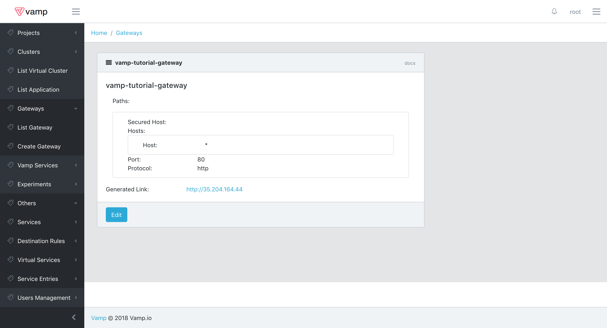
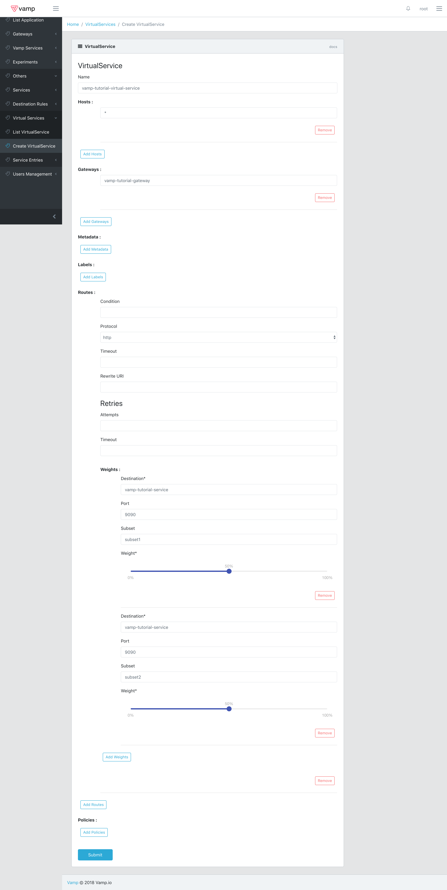
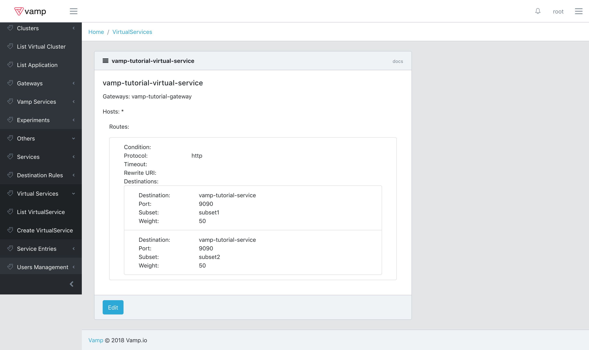

# Vamp Lamia Alpha

Lamia is a single Docker container that provides a REST API and React-based UI that you can use to:

- gradually roll-out a new version of a service;
- automatically rollback to the original version, in the case of errors; and
- apply routing conditions.

This Guide will help you set up Lamia on a kubernetes cluster.

## Table of contents

   * [Prerequisites](#prerequisites)
   * [installation steps](#installation-steps)
      * [Istio Setup](#istio-setup)
      * [Terminology](#terminology)
      * [Performing a canary release](#performing-a-canary-release)
         * [Requirements](#requirements)
         * [Exposing your application](#exposing-your-application)
         * [Creating a Gateway](#creating-a-gateway)
         * [Performing a Canary Release](#performing-a-canary-release-1)
            * [Metric based canary release](#metric-based-canary-release)
            * [Custom canary release](#custom-canary-release)
      * [API](#api)

## Installation

### Prerequisites 
* An existing kubernetes cluster with Kubernetes version 1.9 or above installed. 
* The current version has been tested only on Google Cloud, so it's recommended that you use that as well, in order to avoid issues.
* Kubectl should be installed on the local computer with authorizations to access the cluster.

**Keep in mind that this is an Alpha release targeted at developers and dev/ops. Many of the features are currently limited and will likely change and improve in future versions.**

### Installation steps

git clone this repo or download [setup.zip](https://github.com/magneticio/vamp2setup/releases/download/pre0.0.1/setup.zip)

```
git clone https://github.com/magneticio/vamp2setup.git
```
or
```
wget https://github.com/magneticio/vamp2setup/releases/download/pre0.0.1/setup.zip
unzip setup.zip
```

Run:
```
./vamp-bootstrap.sh
```

Enter password when asked, password will not be visible and it will be asked twice.

Installer will tell you where to connect like:

```
use http://111.122.133.144:8888 to connect
```

If you need to retrieve the IP afterwards you can do it via kubectl

```
kubectl get svc vamp -n=vamp-system
```

Copy the url and paste on your browser and add /ui/#/login

http://111.122.133.144:8888/ui/#/login 

to login and start using.

The default username is root.


### Istio Setup

Once installed, Lamia will automatically check for Istio on the default cluster.
Lamia expects to find the following resources inside the istio-system namesapce:

**Deployments:**

- istio-ca              
- istio-ingress         
- istio-mixer           
- istio-pilot           
- istio-sidecar-injector
- prometheus            

**Services:**

- istio-ingress
- istio-mixer
- istio-pilot
- istio-sidecar-injector
- prometheus
- prometheus-external

**Service Accounts:**

- default
- istio-ca-service-account
- istio-ingress-service-account
- istio-mixer-service-account
- istio-pilot-service-account
- istio-sidecar-injector-service-account
- prometheus


If any of these resources are missing, Lamia will try to install Istio.

**Keep in mind that if you have pre-existing deployments, then after the installation is complete, you will need to restart them or trigger a rolling update in order for the Istio Sidecar to be injected.**

## Terminology

To get a better understanding of how Lamia works you should keep in mind the meaning of the following terms.
Most of them overlap completely with kubernetes entities, but some don't.

- **Project**: a project is a grouping of clusters. This will automatically be created by Lamia.
- **Cluster**: a cluster corresponds to a specific Kubernets clusters. Just like the Project, this will automatically be created by Lamia.
- **Virtual Cluster**: a virtual cluster is a partition of a Cluster and is represented by a Namespace in Kubernetes.
- **Application**: a grouping of related deployments
- **Deployment**: a Kubernetes deployment which represents a specific version of an Application
- **Service**: a Kubernetes service associated with all Deployments of a given Application
- **Ingress**: a Kubernetes ingress exposing an Application Service
- **Gateway**: a component for regulating access to the different versions of an Application through a configured Service. In Kubernetes this corresponds to one or more Istio Route Rules. 
- **Policy**: an automated process that periodically performs actions over an entity. Currently only used for Gateways. For more details refer to the [Performing a canary release](#performing-a-canary-release) section. 

## Performing a canary release

### Requirements

In order to perform a canary release you need to have an Application with at least two Deployments installed in the cluster.

However, before you can begin you need to set up a Virtual Cluster, or add the correct labels to an existing one.

In this section we guide you through the creation of a new Virtual Cluster, but you should be able to use these steps as a basis for updating a pre-existing namespace.
Lamia looks for some specific labels when detecting namespaces to be imported as Virtual Clusters.

These labels are:
- **vamp-managed**: this label indicates that Lamia should import and manage resources from this namespace. They are imported into a Virtual Cluster with the same name.
- **istio-injection**: this label indicates to Istio that it should perform automatic sidecar injection on the deployments in this namespace. 
- **cluster**: (optional) this is the name of the Cluster to which the Virtual Cluster belongs. Lamia creates this label will be automatically if it is missing.
- **project**: (optional) this name of the Project to which the Virtual Cluster belongs. Lamia creates this label will be automatically if it is missing.

Provided the first two labels are set, then once Lamia is deployed, it will import all the resources from a namespace into the current Project and Cluster and add the two optinal labels to the namespace if they are missing.

You can just use the following yaml to create a Virtual Cluster called `vamp-tutorial`.

````
apiVersion: v1
kind: Namespace
metadata:
  labels:
    project: default
    cluster: default
    istio-injection: enabled
    vamp-managed: "true"
  name: vamp-tutorial
````

Just copy it into a file or use the sample [namespace.yaml](samples/namespace.yaml) and then run 

````
kubectl create -f namespace.yaml
````

The new Virtual Cluster will be shown in the corresponding panel on the UI.


You can now edit the metadata of the Virtual Cluster.

For example, you can associate a Slack channel with a Virtual Cluster by adding the following keys:
- **slack_webhook**: a valid webhook
- **slack_channel**: the name of the channel you want to use. The default is `#vamp-notifications`


This will allow Lamia to send notifications to the specified Slack channel.

Once the Virtual Cluster is set up, you need to sure that the Deployments for your Application are created and running.

All deployments require a set of three labels:
- **app**: identifies the Application to which the Deployment belongs.
- **deployment**: identifies the Deployment itself. This is used as a selector for the pods.
- **version**: the version of the Application to which the Deployment belongs. This is used by Istio to dispatch traffic.

For this example you will create two new deployments with the same app label and different deployment and version labels.
To do that, copy the yaml below it into a file, or get it from the sample folder.
Then you can execute:

````
kubectl create -f deployment.yaml
````

````
apiVersion: extensions/v1beta1
kind: Deployment
metadata:
  labels:
    app: vamp-tutorial-app
    version: version1
  name: vamp-tutorial-deployment1
  namespace: vamp-tutorial
spec:
  replicas: 1
  selector:
    matchLabels:
      app: vamp-tutorial-app
      deployment: vamp-tutorial-deployment1
      version: version1
  template:
    metadata:
      labels:
        app: vamp-tutorial-app
        deployment: vamp-tutorial-deployment1
        version: version1
    spec:
      containers:
      - env:
        - name: SERVICE_NAME
          value: version1
        image: magneticio/nodewebservice:2.0.11
        livenessProbe:
          failureThreshold: 5
          httpGet:
            path: /health
            port: 9090
            scheme: HTTP
          periodSeconds: 10
          successThreshold: 1
          timeoutSeconds: 20
        name: deployment1-0
        ports:
        - containerPort: 9090
          protocol: TCP
        readinessProbe:
          failureThreshold: 3
          httpGet:
            path: /ready
            port: 9090
            scheme: HTTP
          periodSeconds: 10
          successThreshold: 1
          timeoutSeconds: 20
---
apiVersion: extensions/v1beta1
kind: Deployment
metadata:
  labels:
    app: vamp-tutorial-app
    version: version1
  name: vamp-tutorial-deployment2
  namespace: vamp-tutorial
spec:
  replicas: 1
  selector:
    matchLabels:
      app: vamp-tutorial-app
      deployment: vamp-tutorial-deployment2
      version: version2
  template:
    metadata:
      labels:
        app: vamp-tutorial-app
        deployment: vamp-tutorial-deployment2
        version: version2
    spec:
      containers:
      - env:
        - name: SERVICE_NAME
          value: version2
        image: magneticio/nodewebservice:2.0.11
        livenessProbe:
          failureThreshold: 5
          httpGet:
            path: /health
            port: 9090
            scheme: HTTP
          periodSeconds: 10
          successThreshold: 1
          timeoutSeconds: 20
        name: deployment1-0
        ports:
        - containerPort: 9090
          protocol: TCP
        readinessProbe:
          failureThreshold: 3
          httpGet:
            path: /ready
            port: 9090
            scheme: HTTP
          periodSeconds: 10
          successThreshold: 1
          timeoutSeconds: 20
````

Assuming you set up everything correctly the deployments will be imported into Lamia and you will be able to check their statuses.
First of all make sure you selected the Virtual Cluster, so opern Virtual Cluster - List Virtual Cluster and click on the only available one.
Now you can open Application - List Application from the bar on the left and you will be presented with the list of available applications.


By selecting the only available application that we just created you will get the list of deployments included in it.


You can easily double-check the information presented through kubectl by executing

````
kubectl get deploy -n=vamp-tutorial
````


### Exposing your application

Now that you have your Application running and two Deployments for it you can create a Service and an Ingress to expose them.
Again you can use the UI to achieve both tasks.
Make sure you seected both the Virtual Cluster and the Application and then simply select Service - Create Service from the bar on the left and fill the form that is shown with the data presented below.


Then submit.
This will create a new Service named vamp-tutorial-service that will be accessible internally to the Cluster.
You can check the status of this Service through the ui by selecting Service - List Service


From here you can edit and delete the Service or simply check its details, which is what we are going to do now.


As you can see the Service has been created with the configuration provided.
You can double-check it with kubectl by running the following command

````
kubectl get svc vamp-tutorial-service -n vamp-tutorial
````

It's now time to expose the Service externally by creating an Ingress.
As you can probably imagine by now, you can achieve that by selecting Ingress - Create Ingress from the bar on the left and filling the form with the values shown below.


Then hit submit.
By accessing Ingress - Ingress List you will be able to check the new Ingress and also retrieve its IP.



The same can be achieved through kubectl by running

````
kubectl get ing vamp-tutorial-ingress -n vamp-tutorial
````

When you have found the ip you can just call

````
http://1.2.3.4
````

by replacing the example ip with your own you will get a response from the service. 
Since you just created a standard Service on top of your application, for the time being all request will be distributed equally among the two Deployments that are part of the application.
To change that behaviour it is necessary to create a gateway.

### Creating a Gateway

In order to regulate access to the different versions of your application you now need to create a Gateway for it.
So, select Gateway - Create Gateway and fill out the form with the data presented below, then hit submit.


You can check the status of the Gateway by clicking on Gateway - Gateway List.
This will display the list of Gateways and by selecting the one you just created you will be able to see its current configuration, as shown below.


The current configuration will tell istio to distribute traffic equally among the two versions, so, for the time being you will not be able to see any difference.
You can however change the weights as you like and experiment with different settings.
**Keep in mind that the weights should always add up to 100, otherwise the configuration will not be applied.**
Checking the Gateway status through kubectl can be a bit harder than the previous scenarios.
While a Gateway is a single entity in Lamia it can correspond, depending on its condition, to multiple Istio Route Rules on kubernetes.
Hence you should runt he following commad:

````
kubectl get routerule -n-vamp-tutorial
````

Thi will list all the route rules in the namespace. 
In this first example we didn't specify any condition, so you will see a singe route rule named vamp-tutorial-gateway-0, but keep in mind you could get multiple result, should you specify complex conditions.
For example, let's try editing our gateway.
Select Gateway - Gateway List and click on edit.
Now specify the following condition:

````
header "User-Agent" regex "^.*(Chrome).*$"  or header "User-Agent" regex "^.*(Nexus 6P).*$"
````

and hit submit.
This will tell the gateway to let into the service only the requests with a user agent containing either "Chrome" or "Nexus 6P".
You can easily test this from a browser or with any tool that allows you to send http requests towards your service.
You can now check what happened on kubernetes by running again the same command as before:

````
kubectl get routerule -n-vamp-tutorial
````

This time you will be presented with two routerules vamp-tutorial-gateway-0 and vamp-tutorial-gateway-1.
The reason for this is that or conditions cannot be handled by a single istio route rule, so it's necessary to create two with different priorities.
You might also find yourself in a situation in which you want to specify different weights for each condtion.
In order to do thta, click on the add button and you will be able to configure a new route with its own condition and set of weights.
You can for example set the following condition:

````
header "User-Agent" regex "^.*(Safari).*$"
````

The gateway configuration will then look like the one shown below.


By doing this you will have all requests with User-Agent containing "Chrome" or "Nexus 6P" equally split between version1 and version2, while all requests with User-Agent containing "Safari" will be sent to version1.
Checking again the configuration on Kubernetes will yield three route rules this time, since the third condition has to be handled separately.
**Mind the fact that, due to a known Istio issue, if you specify a route with a condition, then all routes must also have a condition. Otherwise the Gateway will not work properly.**

Let's now edit again the gateway and remove the conditions you just specified, before moving on to the next step.

### Performing a Canary Release

It's time to try something a bit more complex.
Lamia Gateways allow to specify Policies, that is automated processes than can alter the Gateway configuration over a period of time.
When specifying a new Policy of this kind there are several options, let's start with the simplest one.
Select Gateway - List Gateway - edit and specify the values shown below in the Policies section, then submit.



What you just did will trigger an automated process that will gradually shift the weights towards your target (version2 in this case).
You will periodically get notifications that show the updates being applied to the gateway.
As usual you will be able to check the weights status from the Gateway's detail.
It is also possible to configure the weight change at each update. The default value is 10, but you can specify it by adding the "step" parameter wth the desired value.

This is, of course, a pretty limited example. Usually you would like to put some form of rule to decide which version should prevail.
Lamia can also help you in that scenario.
Go back to the edit screen, remove the policy and reset the weights to 50/50, then submit.

Let's say for example you want to rerun the previous scenario, but checking the healthiness of the two versions before applying changes.
You can esaily achieve that by editing the Gateway as shown in the next image



To verify that everything is working as expected just run this command

````
kubectl replace -f deployment-with-failures.yaml
````

Using the yaml provided in the sample folders, whose content you can find below

````
apiVersion: extensions/v1beta1
kind: Deployment
metadata:
  labels:
    app: vamp-tutorial-app
    version: version2
  name: vamp-tutorial-deployment2
  namespace: vamp-tutorial
spec:
  replicas: 1
  selector:
    matchLabels:
      app: vamp-tutorial-app
      deployment: vamp-tutorial-deployment2
      version: version2
  template:
    metadata:
      labels:
        app: vamp-tutorial-app
        deployment: vamp-tutorial-deployment2
        version: version2
    spec:
      containers:
      - env:
        - name: SERVICE_NAME
          value: version2
        - name: FAILURE
          value: "0.3"
        image: magneticio/nodewebservice:2.0.11
        livenessProbe:
          failureThreshold: 5
          httpGet:
            path: /health
            port: 9090
            scheme: HTTP
          periodSeconds: 10
          successThreshold: 1
          timeoutSeconds: 20
        name: deployment1-0
        ports:
        - containerPort: 9090
          protocol: TCP
        readinessProbe:
          failureThreshold: 3
          httpGet:
            path: /ready
            port: 9090
            scheme: HTTP
          periodSeconds: 10
          successThreshold: 1
          timeoutSeconds: 20
````

This will inject errors on 30% of the requests going towards deployment2 and, consequently, cause the Policy to shift weights towards version1, despite the fact that version2 is the declared target.
Obviously nothing will happen unless you actually send requests to the service.
There's an easy way to do that thanks to the specific image we are using for this tutorial.
Go to Ingress - List Ingress and open the details for the Ingress you previously created.
You will get the following screen


As you can see there's a link to your service. Click it and add /ui at the end to get to this ui.


Now just input the url to your service ( http://vamp-tutorial-service:9090 ) into the empty field and this will both trigger continuous requests towards the service and show the real distribution over the two deployments, including the errors (highlighted in red).
This tool is not really part of Lamia, but it comes in handy to show the behaviour of Gateways and Istio.


After you are done experimenting with this Policy you can return to the previous state by executing

````
kubectl replace -f deployments.yaml
````

and editing the Gateway back to normal.

#### Metric based canary release

But what if you wanted to use some different metric to control the behaviour of the policy?
In order to do that you can edit the Gateway as shown below


As you can see besides changing the type of Policy you also need to specify the **metric** parameter which will tell Lamia which metric or combination of metric to use.
In this scenario the value we are using is:

````
external_upstream_rq_2xx / upstream_rq_total
````

In this case we are basically replicating the behaviour from the health based canary release by calculating the ratio of successful responses over the total number of requests
Metrics names are loosely based on Prometheus metrics names stored by Envoy (they are usually the last part of the metric name).
Some of the available metrics are:

- **external_upstream_rq_200**
- **external_upstream_rq_2xx**
- **external_upstream_rq_500**
- **external_upstream_rq_503**
- **external_upstream_rq_5xx**
- **upstream_rq_total**

This type of Policy, however, comes with a limitation: you can only specify one condition, that is "select the version with the best metric".
What if you wanted to have more complex condition?

#### Custom canary release

To do that you would have to use the last type of Policy available at the moment and configure the Gateway as shown below,
by putting the condition

````
if ( ( metric "version1" "external_upstream_rq_2xx" / metric "version1" "upstream_rq_total" ) > ( metric "version2" "external_upstream_rq_2xx" / metric "version2" "upstream_rq_total" ) ) { result = version1; } else if ( ( metric "version1" "external_upstream_rq_2xx" / metric "version1" "upstream_rq_total" ) < ( metric "version2" "external_upstream_rq_2xx" / metric "version2" "upstream_rq_total" ) ) { result = version2; } else { result = nil; } result
````

in the value field for the metric parameter


As you can probably understand by looking at the expression above, this Policy will again replicate the behaviour of the previous Policies, but it will allow for much greater flexibility.
You will now be able to specify different versions based on the conditions you are verifying and also to return no version at all (by returning nil) when you want the Policy to not apply any change.

## API

All the operations performed during this tutorial are also achievable through the API. You can reach the documentation for Lamia API at the following url:

````
http://1.2.3.4/swagger
````

where 1.2.3.4 should be replaced with your ip.
Mind the fact that loading the documentation might take some time.


