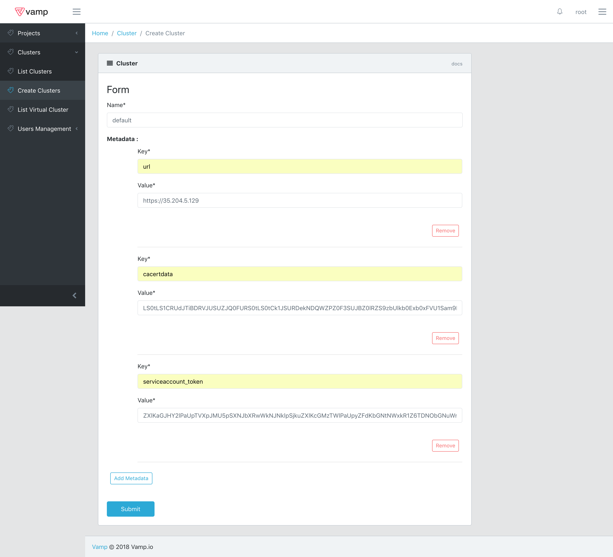

# Cluster setup

If Lamia has been installed inside a Cluster it will automatically create a default Project and Cluster.
If you are instead running Lamia outside a Cluster there are a few extra steps you need to take.

# Table of contents

* [Project Creation](#project-creation)
* [Cluster Creation](#cluster-creation)
* [Istio Setup](#istio-setup)

## Project Creation

First of all you need to create a Project.
A Lamia Project is simply an abstraction grouping one of more Clusters.
You can create a Project by clicking on Create Project and filling out the form below, which, at this time, requires only the Project's name to be specified.


Once the Project has been created it will appear int he Project List and you will be able to select it.

## Cluster Creation

After setting up and selecting the new Project, it's time to do the same for the Cluster.
This unfortunately still requires some manual operation.
First of all you need to initialise the cluster by creating a namespace and Service Account that would grant Vamp Lamia the authorisations it requires to manage the Cluster itself, and then retrieve the Cluster url and the service account token and certificate.
This may seem complex but you can just run 

```
./initialise-cluster.sh
```

and all the required operations will be performed, returning as an output the url, certificate and token.
Once you have these values you can click on create Cluster in Vamp Lamia and fill out the form as shown below:



Once you submit the Cluster will be imported in Lamia

## Istio Setup

Lamia will automatically check for Istio on each cluster it is connected to.
Lamia expects to find the following resources inside the istio-system namesapce:

**Deployments:**

- grafana                   
- istio-citadel             
- istio-egressgateway       
- istio-ingressgateway      
- istio-pilot               
- istio-policy              
- istio-sidecar-injector    
- istio-statsd-prom-bridge  
- istio-telemetry           
- istio-tracing             
- prometheus                
- servicegraph      

**Services:**

- grafana                   
- istio-citadel             
- istio-egressgateway       
- istio-ingressgateway      
- istio-pilot               
- istio-policy              
- istio-sidecar-injector    
- istio-statsd-prom-bridge  
- istio-telemetry           
- prometheus                
- prometheus-external       
- servicegraph              
- tracing                   
- zipkin                    

**Service Accounts:**

- default
- istio-citadel-service-account          
- istio-cleanup-old-ca-service-account   
- istio-egressgateway-service-account    
- istio-ingressgateway-service-account   
- istio-mixer-post-install-account       
- istio-mixer-service-account            
- istio-pilot-service-account            
- istio-sidecar-injector-service-account 
- prometheus   

**ConfigMaps:**

- istio                                   
- istio-ingress-controller-leader-istio   
- istio-mixer-custom-resources            
- istio-sidecar-injector                  
- istio-statsd-prom-bridge                
- prometheus                              

and the following int he logging namespace

**Deployments:**

- elasticsearch  
- fluentd-es     
- kibana         

**Services:**

- elasticsearch         
- elasticsearch-external
- fluentd-es            
- kibana                             

**ConfigMaps:**

- fluentd-es-config
- mapping-config

If any of these resources are missing, Lamia will try to install Istio.

**Keep in mind that if you have pre-existing deployments, then, after the installation is complete, you will need to restart them or trigger a rolling update in order for the Istio Sidecar to be injected.**
